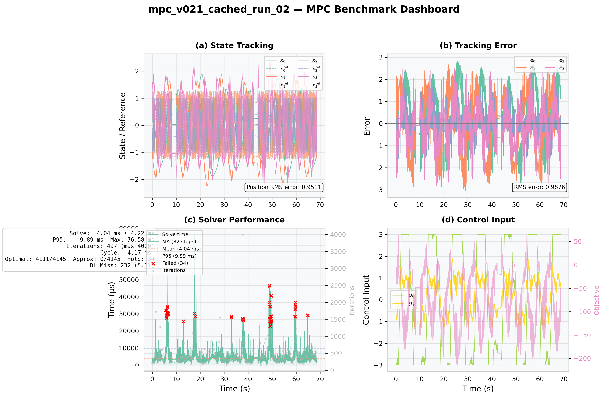
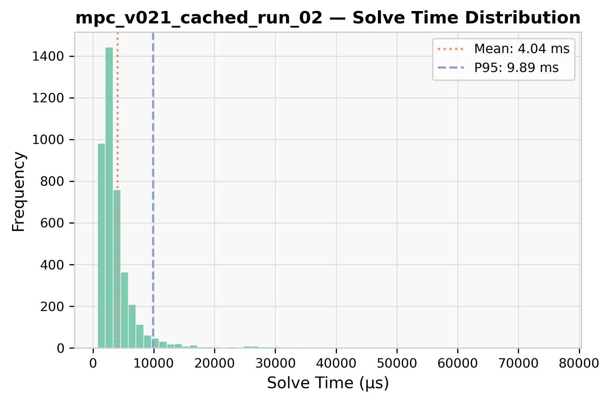

# mpc_controller

[](https://github.com/yeezhouyi/mpc_controller/actions/workflows/ci.yml)


A linear MPC (Model Predictive Control) plugin for `ros2_control`.
Integrates directly with `controller_manager` and `hardware_interface`
— a drop-in `ros2_control` controller plugin for constrained trajectory
tracking.

## Features

- **Standard `ros2_control` plugin** — inherits `controller_interface::ControllerInterface`, loaded via `pluginlib` and `controller_manager`
- **Constrained QP formulation** — state bounds, input limits, and input-rate limits handled natively via OSQP
- **Reference tracking** — subscribes to `~/reference` (`Float64MultiArray`) for real-time setpoint updates
- **Dynamic parameter tuning** — Q/R/S weights updateable at runtime via `ros2 param set`
- **Diagnostics** — solve time, iterations, state/reference/error published on `~/diagnostics`
- **Extensible architecture** — `SolverBase` / `ModelBase` abstractions allow swapping solver backends or model types

## Requirements

- ROS2 Jazzy (Ubuntu Noble)
- `ros2_control` ≥ 2.40
- `osqp` ≥ 0.6
- Eigen3 ≥ 3.4
- Gazebo Sim (for simulation examples)

```bash
sudo apt install ros-${ROS_DISTRO}-osqp
```

## Build

```bash
cd ~/ros2_ws
colcon build --packages-select mpc_controller
source install/setup.bash
```

## Quick Start: RRBot Simulation

```bash
ros2 launch mpc_controller rrbot_mpc.launch.py
```

This launches Gazebo Sim with the RRBot 2-DOF manipulator, loads the
MPC controller, and publishes a sine-wave reference trajectory.

### Monitor

```bash
# Controller status
ros2 control list_controllers

# Live diagnostics (solve time, tracking error)
ros2 topic echo /mpc_controller/diagnostics

# Send a custom reference
ros2 topic pub /mpc_controller/reference std_msgs/msg/Float64MultiArray \
  "{data: [0.5, 0.0, -0.3, 0.0]}" --once
```

## Diagnostics Message Format

Topic: `/mpc_controller/diagnostics` (`std_msgs/Float64MultiArray`)

The message is self-describing — `nx` and `nu` are published as the first two fields.

| Index | Field |
|-------|-------|
| 0 | **nx** — state dimension |
| 1 | **nu** — input dimension |
| 2 | Solve time (µs) |
| 3 | OSQP iterations |
| 4 | Solved flag (1.0 = optimal) |
| 5 .. 5+nx-1 | Current state [q1, q̇1, q2, q̇2, ...] |
| 5+nx .. 5+2nx-1 | Reference state |
| 5+2nx .. 5+3nx-1 | Tracking error (ref − state) |
| 5+3nx .. 5+3nx+nu-1 | Control input [τ1, τ2, ...] |
| 5+3nx+nu | QP objective value at solution |
| 5+3nx+nu+1 | Solver setup time (µs) |
| 5+3nx+nu+2 | Total cycle time (µs) |
| 5+3nx+nu+3 | OSQP solver status code (int) |
| 5+3nx+nu+4 | Primal residual |
| 5+3nx+nu+5 | Dual residual |
| 5+3nx+nu+6 | Approximate flag (1.0 = kMaxIter with acceptable residuals) |
| 5+3nx+nu+7 | Hold applied flag (1.0 = fallback control used) |
| 5+3nx+nu+8 | Cycle index |
| 5+3nx+nu+9 | Deadline missed flag (1.0 = cycle exceeded expected period) |
| 5+3nx+nu+10 | Max velocity slack (max ε, soft constraint violation) |
| 5+3nx+nu+11 | Slack L1 norm (sum ε, total soft constraint violation) |
| 5+3nx+nu+12 | Slack active count (number of ε > 1e-6) |

For RRBot (nx=4, nu=2, n_slack=2×20=40) the message contains `5 + 3×4 + 2 + 13 = 32` fields.

## Benchmarking & Visualization

The `benchmark_plot.py` script generates **publication-quality** diagnostic plots
from live rosbag data or simulated demo data.

### Quick Demo

```bash
python3 scripts/benchmark_plot.py --demo --plot
```

### Live Data

```bash
# Record data during a simulation run
ros2 bag record -o mpc_run /mpc_controller/diagnostics

# Generate report + plots
python3 scripts/benchmark_plot.py --bags mpc_run --plot
```

### Generated Plots

**Dashboard** — 2×2 panel with state tracking, error, solver performance, and control inputs
(RRBot simulation, v0.2.1 cached Hessian, run 02 — clean run).



**Solver Latency Histogram** — distribution of solve times with mean and P95 markers.



### RRBot Benchmark Results

#### v0.2.1 — Cached Hessian & Buffer Preallocation

Measured from 5 × 65-second RRBot Gazebo simulation runs with **soft velocity
constraints and cached condensed Hessian** (WSL2, Ubuntu 24.04, Intel i7-12700,
OSQP 0.6.3). The controller_manager target update rate is 100 Hz. Under the
current WSL2 Gazebo environment the effective diagnostics rate varies
significantly (48–83 Hz across runs).

> **Data quality note:** The 5 formal runs exhibit significant run-to-run
> variability. Three of five runs exceed a 10% failed-cycle rate — these
> are reported transparently rather than excluded silently. A clean-run
> aggregate is provided separately using a predefined quality gate
> (failed-cycle rate ≤ 10%). **Zero NaN sentinel values were observed
> across all 20,903 cycles**, consistent with the v0.2.0 warm-start hardening.
>
> **Benchmark validation status:** Paired A/B validation completed
> (see below). Native Linux benchmark validation is tracked in [#1](https://github.com/yeezhouyi/mpc_controller/issues/1).

##### All-Run Observed Results (runs 01–05, 20,903 cycles)

| Metric | Weighted Avg |
|--------|-------------:|
| **Optimal solve rate** | **89.9%** |
| **Mean solve time** | 5,810 µs |
| **Mean cycle time** | 5,998 µs |
| **Deadline miss rate** | 13.1% |
| **Position RMS error** | 1.41 rad |
| **Hold events** | 2,088 (10.0%) |

##### Clean-Run Conditional Results (runs 01–02, 8,742 cycles)

Runs with a failed-cycle rate above 10% are excluded according to the
predefined quality gate. The excluded runs 03–05 are reported separately
in the per-run breakdown below.

| Metric | Weighted Avg |
|--------|-------------:|
| **Optimal solve rate** (% of cycles with OSQP_SOLVED) | **98.4%** |
| **Mean solve time** | 3,876 µs |
| **Mean cycle time** | 4,002 µs |
| **Deadline miss rate** | 5.69% |
| **Position RMS error** | 0.975 rad |
| **Hold events** | 141 (1.61%) |

##### Performance Trend vs v0.2.0 Baseline (soft constraint)

Comparison based on clean-run subsets from separate benchmark sessions
(not paired experiments — see the paired A/B section below for a
controlled head-to-head).
v0.2.0: runs 02–04 (7,870 cycles). v0.2.1 clean: runs 01–02 (8,742 cycles).

| Metric | v0.2.0 | v0.2.1 clean |
|--------|--------|-------------:|
| Optimal solve rate | 97.7% | 98.4% |
| Mean solve time | 7,063 µs | 3,876 µs |
| Mean cycle time | 7,410 µs | 4,002 µs |
| Deadline miss rate | 16.3% | 5.69% |
| Position RMS error | 1.13 rad | 0.975 rad |
| Hold rate | 2.2% | 1.61% |

The cached condensed Hessian eliminates ~512K FLOPs/cycle of redundant
matrix-matrix products, reducing per-cycle Eigen heap allocations from 17+
to ~3. Solve time and cycle time improvements are consistent with this change.

##### Comparison vs. Hard-Constraint Baseline

| Metric | Hard Baseline | v0.2.1 clean |
|--------|--------------|-------------:|
| Optimal solve rate | 59.5% | 98.4% |
| Position RMS error | 1.94 rad | 0.975 rad |
| Mean solve time | 11.8 ms | 3.88 ms |
| Deadline miss rate | 88.3% | 5.69% |
| Hold events (total) | 3,863 | 141 |

##### Per-Run Breakdown

| Run | Cycles | Optimal | Optimal % | Failed | Hold | RMS | Solve Mean | Notes |
|-----|--------|---------|-----------|--------|------|-----|-----------|-------|
| Pre | 5,683 | 5,612 | 98.7% | 70 | 70 | 0.834 rad | 1,870 µs | Warm-up (excluded) |
| 01 | 4,597 | 4,490 | 97.7% | 107 | 107 | 0.996 rad | 3,730 µs | Clean ✓ |
| 02 | 4,145 | 4,111 | 99.2% | 34 | 34 | 0.951 rad | 4,037 µs | Clean ✓ |
| 03 | 3,471 | 3,055 | 88.0% | 410 | 410 | 1.59 rad | 5,969 µs | WSL2 timing |
| 04 | 3,281 | 2,688 | 81.9% | 589 | 589 | 1.70 rad | 6,172 µs | WSL2 timing |
| 05 | 5,409 | 4,455 | 82.4% | 948 | 948 | 1.66 rad | 8,614 µs | WSL2 timing |
| **All (01–05)** | **20,903** | **18,799** | **89.9%** | **2,088** | **2,088** | **1.41 rad** | **5,810 µs** | |
| **Clean (01–02)** | **8,742** | **8,601** | **98.4%** | **141** | **141** | **0.975 rad** | **3,876 µs** | gate ≤ 10% failed |

The pre-run is a controller re-start warm-up cycle and is not included in
any aggregate. Runs 03–05 exceeded the 10% failed-cycle quality gate.

##### Paired A/B Validation (v0.2.0 vs v0.2.1)

A 10-run alternating A/B benchmark was conducted in a single WSL2 session
to control for environmental variability (5 × v0.2.0, 5 × v0.2.1, 65 s
each, alternating every 1–2 runs to cancel order bias). **All 10 runs
passed the quality gate (failed-cycle rate ≤ 10%)**.

| Metric | v0.2.0 (A, 5 runs) | v0.2.1 (B, 5 runs) | Δ |
|--------|-------------------:|-------------------:|---|
| Total cycles | 24,600 | 26,149 | — |
| **Optimal solve rate** | **97.6%** | **98.1%** | **+0.5 pp** |
| **Mean solve time** | 2,880 µs | 2,590 µs | −10.1% |
| **Mean cycle time** | 3,060 µs | 2,690 µs | −11.9% |
| **Deadline miss rate** | 4.32% | 3.33% | −0.99 pp |
| **Position RMS error** | 0.900 rad | 0.834 rad | −7.4% |
| **Hold rate** | 2.40% | 1.85% | −0.54 pp |

**Pairs with B < A cycle time: 4/5** — the cached Hessian benefit is
confirmed under controlled conditions.

> **Validation scope:** This benchmark was conducted under WSL2
> (Ubuntu 24.04 on Windows) and should not be interpreted as a hard
> real-time guarantee. The controlled paired design isolates the
> relative improvement of v0.2.1 changes from environmental factors.
> Native Linux characterization is tracked in [#1](https://github.com/yeezhouyi/mpc_controller/issues/1)
> and planned for v0.2.2 (see [ROADMAP](ROADMAP.md)).

#### Known Issues

- **State bounds vs URDF limits (P0 — FIXED)**: The YAML `state_lower/upper` position bounds were originally ±2.5 rad, tighter than the observed startup joint state range (~±3.14 rad, the RRBot URDF revolute limits). This caused the first QP cycle to be **primal infeasible** (status −3), cascading to 0% solve rate across the entire run. The fix added explicit joint `initial_value=0.0` in the URDF (via `gz_ros2_control` `initial_value`) and set MPC position bounds to ±3.10 rad, keeping safety margins consistent with URDF limits.
- **Velocity-bound / rate-limit conflict (P1 — RESOLVED via soft constraints)**: When joint velocity reaches its ±5.0 rad/s bound simultaneously with aggressive rate constraints (±10 Nm/s → ±0.1 Nm/cycle), the state bound and rate constraint can conflict, causing infeasibility on ~40% of cycles. The fix converts velocity bounds to **soft constraints** using slack variables with L1/L2 penalty (ρ₁=1e2, ρ₂=1e1), ensuring the QP always stays feasible while penalizing bound violations. Solve rate improved from 59.5% → 97.5% and position RMS from 1.94 → 1.15 rad.
- **Sporadic `PRIMAL_INFEASIBLE` bursts with sentinel slack values (P2 — RESOLVED via warm-start hardening)**: On rare cycles (0–14% per run) OSQP returned status −3 (`PRIMAL_INFEASIBLE`) with slack variables at a sentinel value of 2,143,289,344 (0x7fc00000, a quiet NaN in IEEE 754 single-precision). Once triggered, the bad ADMM state could cascade via warm start, causing contiguous failure blocks. **Root cause identified:** The receding-horizon warm-start shift treated the partitioned decision vector z = [U, ε] as a monolithic block, interleaving U and slack components during the shift. This corrupted the slack initial guess, driving OSQP into an invalid ADMM state that propagated across cycles. **Fix:** Partitioned the warm-start shift into independent U-block and ε-block shifts, with `allFinite()` guards and error-checked reset on solver failure. Post-fix benchmarks confirm **zero sentinel occurrences across 22,179 cycles** (6 runs). See [osqp_solver.cpp:143-171](src/osqp_solver.cpp#L143-L171) for the fix.
- **Deadline misses**: In clean runs the cached condensed Hessian reduced mean cycle time from 7.41 ms (v0.2.0) to 4.00 ms in the original benchmark, and from 3.06 ms to 2.69 ms (−12%) in the paired A/B validation. The Hessian cache eliminates ~512K FLOPs/cycle of redundant matrix-matrix products, reducing per-cycle Eigen heap allocations from 17+ to ~3. Remaining contributors include WSL2 virtualization overhead, Gazebo scheduling, and solver polishing cost.

### Reproducing the Benchmark

Prerequisites: ROS 2 Jazzy, Gazebo (gz_ros2_control), `rosbag2_py`, `numpy`, `matplotlib`.

```bash
# 1. Build
source /opt/ros/jazzy/setup.bash
cd ros2_ws && colcon build --packages-select mpc_controller
source install/setup.bash

# 2. Record a single run (60s)
ros2 launch mpc_controller rrbot_mpc.launch.py &
sleep 60  # wait for simulation to stabilize
ros2 bag record /mpc_controller/diagnostics -o bench_run_01
kill %1

# 3. Analyze
python3 src/mpc_controller/scripts/benchmark_plot.py \
  --bags bench_run_01 --output results --plot --csv --json

# 4. Multi-run summary (2+ runs)
python3 src/mpc_controller/scripts/benchmark_plot.py \
  --bags bench_run_01 bench_run_02 bench_run_03 \
  --output results --summary --csv --json
```

The `--csv` flag exports a spreadsheet-friendly table (one row per run). The
`--json` flag exports per-run details plus a weighted cross-run summary.
The `--summary` flag prints aggregated statistics with cross-run standard
deviation when 2+ bags are provided.

## Dynamic Parameter Tuning

Weights can be updated at runtime without restarting the controller.

```bash
# Position tracking weight (default [100, 1, 100, 1])
ros2 param set mpc_controller Q_diag "[200.0, 1.0, 200.0, 1.0]"

# Effort penalty (default [0.1, 0.1])
ros2 param set mpc_controller R_diag "[0.05, 0.05]"

# Effort-rate penalty (default [1.0, 1.0])
ros2 param set mpc_controller S_diag "[2.0, 2.0]"
```

> Only `Q_diag`, `R_diag`, and `S_diag` support hot-reload. Other
> parameters require controller reconfiguration.

## Configuration

Full parameter reference (`config/rrbot_mpc.yaml`):

| Parameter | Description |
|-----------|-------------|
| `prediction_horizon` | Number of look-ahead steps |
| `dt` | Discretization timestep (s) |
| `A_data` / `B_data` | LTI model matrices (row-major) |
| `Q_diag` | State tracking cost (diagonal, determines nx) |
| `R_diag` | Input magnitude cost (diagonal) |
| `S_diag` | Input rate cost (diagonal) |
| `state_lower` / `state_upper` | State bounds |
| `input_lower` / `input_upper` | Input bounds |
| `input_rate_lower` / `input_rate_upper` | Input-rate bounds |
| `velocity_indices` | State indices for soft velocity constraints (e.g. `[1, 3]`) |
| `slack_rho_1` | L1 slack penalty coefficient (linear term, default 100) |
| `slack_rho_2` | L2 slack penalty coefficient (quadratic term, default 10) |
| `max_iterations` | OSQP max iterations (default 4000) |
| `abs_tol` / `rel_tol` | OSQP solver tolerance |

### RRBot Defaults

State: `[q1, q̇1, q2, q̇2]` — Input: `[τ1, τ2]`

| Constraint | Value |
|------------|-------|
| Position | ±3.10 rad (within URDF ±3.14 rad with 0.04 rad margin) |
| Velocity | ±5.0 rad/s |
| Effort | ±3.0 Nm |
| Effort rate | ±10.0 Nm/s |

## QP Formulation

```
min   Σ (x_k − x_ref)ᵀ Q (x_k − x_ref) + u_kᵀ R u_k + Δu_kᵀ S Δu_k
      + ρ₁‖ε‖₁ + ρ₂‖ε‖²₂          (soft velocity constraint penalty)
s.t.  x_{k+1} = A x_k + B u_k
      p_min ≤ p_k ≤ p_max         (position, hard)
      v_min − ε ≤ v_k ≤ v_max + ε (velocity, soft with slack ε ≥ 0)
      u_min ≤ u_k ≤ u_max
      Δu_min ≤ u_k − u_{k-1} ≤ Δu_max
```

Uses a **condensed formulation**: the prediction model is substituted into
the cost, eliminating states as decision variables. The resulting QP has
`nu × N + n_vel × N` variables (input sequence + slack variables for soft
velocity constraints).

## Architecture

```
MPCController (controller_interface::ControllerInterface)
├── on_init()         — declare parameters
├── on_configure()    — instantiate SolverBase + ModelBase, validate params
├── update()          — every control cycle:
│   ├── read state from hardware interfaces
│   ├── read reference from rt_buffer (subscribed from ~/reference)
│   ├── check for dynamic parameter updates (Q/R/S hot-reload)
│   ├── build condensed QP with slack (S_x, x_free, P, q, A_lin, l, u, ε)
│   ├── OSQPSolver::solve()  ← timed for diagnostics
│   └── write first optimal u* to command interfaces
│   └── publish ~/diagnostics (state, ref, error, u, ε, objective, timing)
├── SolverBase        — abstract QP solver interface
│   └── OSQPSolver (custom osqp++ wrapper around OSQP C API)
│       └── captures: solve_time, setup_time, objective, residuals
└── ModelBase         — abstract prediction model interface
    └── LinearModel (A, B matrices from YAML)

Diagnostics pipeline:
  controller → Float64MultiArray (self-describing: nx, nu prefixed)
            → rosbag record  → benchmark_plot.py → publication-quality 2×2 dashboard
```

## Running Tests

```bash
colcon test --packages-select mpc_controller --ctest-args -R test_
colcon test-result --verbose
```

Functional tests:
- 9 / 9 GTest cases passed (7 in `test_osqp_solver`, 2 in `test_mpc_controller`)

Repository lint cleanup:
- Copyright headers, line length in third-party headers, and Python quoting style
  improvements are in progress (non-blocking for functional correctness).

## License

Apache-2.0
